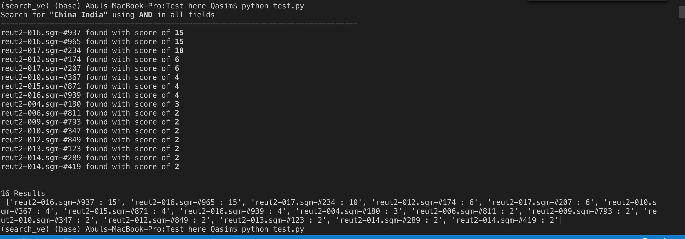

### Set up virtual env
On mac type 
> pip install virtualenv
 virtualenv search_ve -p python3.7
 source search_ve/bin/activate

here "search_ve" is my virtual environment. 

### Install project dependencies
>$pip install -r requirements.txt

### Building corpus. 
from Model/Pre_processing Run 
>python build_corpus.py 

### Dictionary Building 
from Model/Dictionary/ Run
> python build_dict.py

### Inverted Index
from Model/InvertedIndex/build_ii.py run
>python build_ii.py
### Corpus access (future use - UI)
from Model/CorpusAccess/corpusAccess.py 
>python corpuAccess.py

###VSM and Bool search
Model/vsm_bol_search/search.py

This will return us search results with their score based on weight, tf, tf-idf and boolean model if selected by default set to AND
>python search.py

>query('China India')

## learn
#### we used a templating language. Jinja2 comes with Flask, so there is no extra setup needed.
* A templating language works in conjunction with a web server. It takes the output of your Python scripts (the back-end code), and makes it easy to output to the user using HTML (the front-end). It’s important to note that templates should not be used for logic! Keep the logic in Python, and use templates only for displaying the data. It gets very messy if you start trying to get complex with the template.